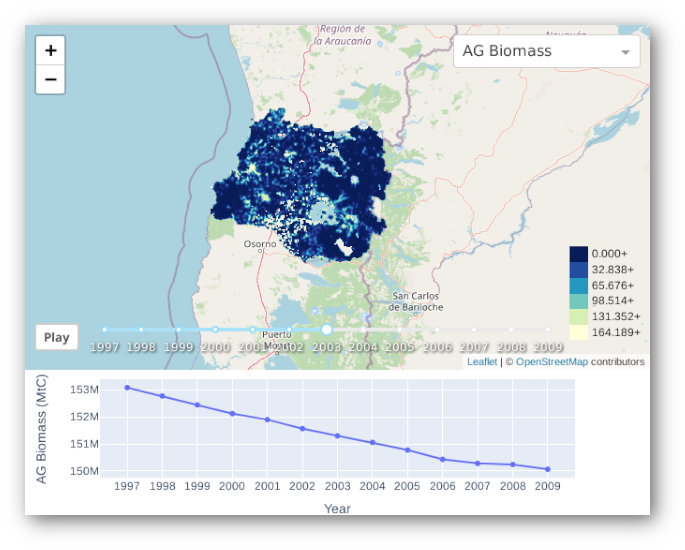

# Taswira

> An interactive visualisation tool for GCBM.




Taswira aims to be an easy-to-use utility to help the users of the Generic Carbon Budget Model (GCBM). It takes output generated by GCBM and creates a browser-based UI that allows users to:

* View previews of the spatial data overlaid on an interactive map.
* View graphs of ecosystem indicators from the non-spatial output.
* Visually cycle through the time-series of the spatial output.

## Install

Requires [Git] and [Miniconda] (or Anaconda) with Python 3.6 or newer.

1. Clone the repository and `cd` into it:

```sh
git clone https://github.com/moja-global/taswira
cd taswira
```

2. Create a conda environment and activate it:

```sh
conda env create -f environment.yml

conda activate taswira
```

3. Install the Python package:

```sh
pip install -e .
```

Taswira is now installed, see [Usage](#usage) below.

### Using Docker

You can also use Taswira through [Docker]. For that, build a container image:

```sh
DOCKER_BUILDKIT=1 docker build -t taswira:latest .
```

And then use it to run Taswira:

```sh
docker run taswira
```

[Miniconda]: https://docs.conda.io/en/latest/miniconda.html
[Git]: https://git-scm.com/
[Docker]: https://docs.docker.com/get-docker/

## Usage

```
usage: taswira [-h] [--allow-unoptimized] config spatial_results db_results

Interactive visualization tool for GCBM

positional arguments:
  config               path to JSON config file
  spatial_results      path to GCBM spatial output directory
  db_results           path to compiled GCBM results database

optional arguments:
  -h, --help           show this help message and exit
  --allow-unoptimized  allow processing unoptimized raster files
```

**NOTE**: `spatial_results` directory should contain GeoTIFFs with filenames that match the pattern `{title}_{year}.tiff`.

### Configuration Schema

`config` should be a valid JSON file with an array of environment indicator configurations, each of which can have the following keys:

Key                | Description                                            | Required
------------------ | ------------------------------------------------------ | --------
database_indicator | Database column that contains indicator's value        | Yes
file_pattern       | Pattern that matches to the filenames of the indicator | Yes
palette            | A valid colormap string                                | Yes
title              | Human-friendly title of the indicator                  | No
graph_units        | Unit to use in the graph                               | No

Example config file:
```json
[
  {
    "database_indicator": "NPP",
    "file_pattern": "NPP*.tiff",
    "graph_units": "Ktc",
    "palette": "Greens"
  },
  {
    "database_indicator": "NBP",
    "file_pattern": "NBP*.tiff",
    "palette": "Greens"
  },
  {
    "database_indicator": "NEP",
    "file_pattern": "NEP*.tiff",
    "palette": "Reds"
  },
  {
    "title": "AG Biomass",
    "database_indicator": "Aboveground Biomass",
    "file_pattern": "AG_Biomass_C_*.tiff",
    "palette": "YlGnBu",
    "graph_units": "Mtc"
  }
]
```

## Repository Contributors

Thanks goes to these wonderful people ([emoji key](https://allcontributors.org/docs/en/emoji-key)):

<!-- ALL-CONTRIBUTORS-LIST:START - Do not remove or modify this section -->
<!-- prettier-ignore-start -->
<!-- markdownlint-disable -->
<table>
  <tr>
    <td align="center"><a href="http://moja.global"><br /><sub><b>moja global</b></sub></a><br /><a href="#projectManagement-moja-global" title="Project Management">📆</a></td>
    <td align="center"><a href="https://abhineet.tk"><br /><sub><b>Abhineet Tamrakar</b></sub></a><br /><a href="https://github.com/moja-global/GCBM.Visualisation_Tool/commits?author=abhineet97" title="Documentation">📖</a> <a href="https://github.com/moja-global/GCBM.Visualisation_Tool/commits?author=abhineet97" title="Code">💻</a></td>
    <td align="center"><a href="https://github.com/kaskou"><br /><sub><b>kaushik surya sangem</b></sub></a><br /><a href="https://github.com/moja-global/GCBM.Visualisation_Tool/pulls?q=is%3Apr+reviewed-by%3Akaskou" title="Reviewed Pull Requests">👀</a></td>
    <td align="center"><a href="https://github.com/gmajan"><br /><sub><b>Guy Janssen</b></sub></a><br /><a href="#projectManagement-gmajan" title="Project Management">📆</a></td>
  </tr>
</table>

<!-- markdownlint-enable -->
<!-- prettier-ignore-end -->
<!-- ALL-CONTRIBUTORS-LIST:END -->

This project follows the [all-contributors](https://github.com/all-contributors/all-contributors) specification. Contributions of any kind are welcome!

## Maintainers Reviewers Ambassadors Coaches

The following people are Maintainers Reviewers Ambassadors or Coaches
<table><tr>

<td align="center"><a href="https://abhineet.tk"><br /><sub><b>Abhineet Tamrakar</b></sub></a><br /><a href="https://github.com/moja-global/GCBM.Visualisation_Tool/commits?author=abhineet97" title="Documentation">📖</a> <a href="https://github.com/moja-global/GCBM.Visualisation_Tool/commits?author=abhineet97" title="Code">💻</a></td>
    <td align="center"><a href="https://github.com/kaskou"><br /><sub><b>kaushik surya sangem</b></sub></a><br /><a href="https://github.com/moja-global/GCBM.Visualisation_Tool/pulls?q=is%3Apr+reviewed-by%3Akaskou" title="Reviewed Pull Requests">👀</a></td>
</tr>
</table>

**Maintainers** review and accept proposed changes\
**Reviewers** check proposed changes before they go to the Maintainers\
**Ambassadors** are available to provide training related to this repository\
**Coaches** are available to provide information to new contributors to this repository
